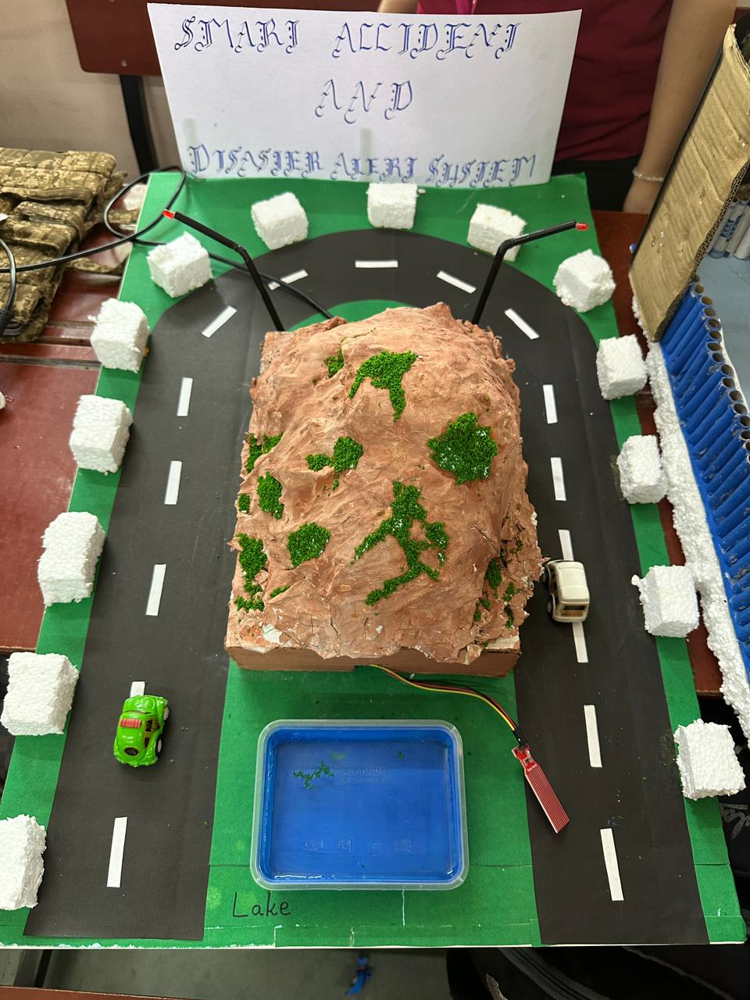
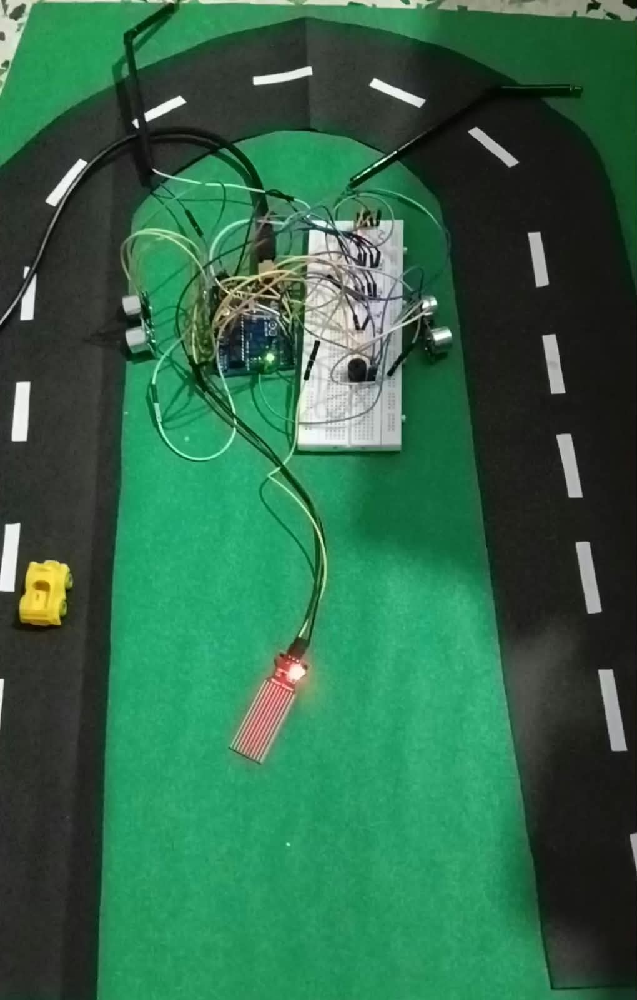

# Smart Accident & Disaster Alert System

An Arduino-based IoT safety system built for two real-world hazard scenarios: blind mountain-curve vehicle collisions and flood risk from rising water levels.

## What it does

**Accident prevention (blind mountain curve alert):**
On a road with a mountain blocking the view at a curve, an ultrasonic sensor is placed on each side of the road. When a vehicle approaches from one side, its sensor detects it and triggers the LED on the *opposite* side of the road — warning any vehicle coming from the other direction that a car is approaching, even though the mountain blocks their direct line of sight.

**Disaster alert (flood/water level detection):**
A water level sensor continuously monitors nearby water levels (represented by the lake in the model). If the level rises above a safe threshold, a buzzer sounds to alert people nearby of potential flooding.

## Hardware used
- Arduino Uno
- Ultrasonic sensors (x2) — one on each side of the road
- LEDs (x2) — one on each side, triggered by the opposite sensor
- Water level sensor
- Buzzer
- Breadboard, jumper wires

## How it works
1. Each ultrasonic sensor continuously checks for an oncoming vehicle on its side of the road.
2. To avoid false triggers from sensor noise, detection uses a near/far threshold: the LED turns **on** once a vehicle is within ~10cm, and turns **off** only once it's past ~35cm, ignoring readings in between.
3. When a sensor detects a vehicle, the Arduino turns on the LED on the *opposite* side, warning that driver before they reach the blind curve.
4. Simultaneously, the water level sensor reads the surrounding water level.
5. If the reading crosses a set threshold, the Arduino triggers the buzzer as a flood warning.

## Why I built it
Built as a college project to explore how simple, low-cost IoT sensors can address real safety problems — blind-curve accidents on mountain roads and flash flooding are both common and often preventable with early warning.

## What I'd improve next
- Add a wireless alert (e.g. SMS/app notification) instead of just a local LED/buzzer
- Add a distance-based warning (closer vehicle = faster blinking LED) instead of just on/off
- Log water level data over time to spot flooding patterns early

## Demo

Internal wiring and components:

